# csi-xen-orchestra-driver

> [!WARNING]
> Under active development.

CSI Driver for Xen-orchestra-managed xcp-ng environments.

## Requirements
- [Xen Orchestra (XO)](https://docs.xcp-ng.org/management/manage-at-scale/xo-web-ui/)
- Kubernetes Cluster:
    - with [xenorchestra-cloud-controller-manager](https://github.com/vatesfr/xenorchestra-cloud-controller-manager/tree/main)
- Kubernetes Nodes: 
  - with `xe-guest-utils` installed

## Compatibility

Expecting much broader compatibility, but for now only tested on 1.30 (with Talos).

| Driver | Kubernetes |
| --- | --- |
| v0.2.x | 1.30 (tested) |
| v0.1.x | 1.30 (tested) |

## Features
- Dynamic provisioning (create disks on demand via PVCs)
- Migration of disks between storage repositories (see: [Disk Migrations](docs/disk-migrations.md))
- Static provisioning (use an existing VDI by UUID)
- Offline volume expansion
- Topology aware (pool, and optionally host)

## Documentation

Start here
- [Getting started](docs/getting-started.md)

How to use the driver
- selecting [Storage Repositories](docs/storage-repositories.md)
- feature [Disk Migrations](docs/disk-migrations.md)
- pre existing [Static volumes](docs/static.md)
- considerations when using [Local Storage](docs/local-storage.md)

Configuration
- [StorageClass parameters](docs/storage-class.md)
- [Driver configuration (flags, authentication)](docs/driver-configuration.md)

Operational notes
- [Disk creation leakage and mitigations](docs/disk-creation-leakage.md)

Development
- [Development](DEVELOPMENT.md)

## Contributing

Contributions are welcome. 

## TODO/Roadmap

- Prometheus metrics
- Kubernetes Support Matrix (and test up to latest kubernetes)
- Investigate what happens when running without cloud-controller-manager and degrade gracefully