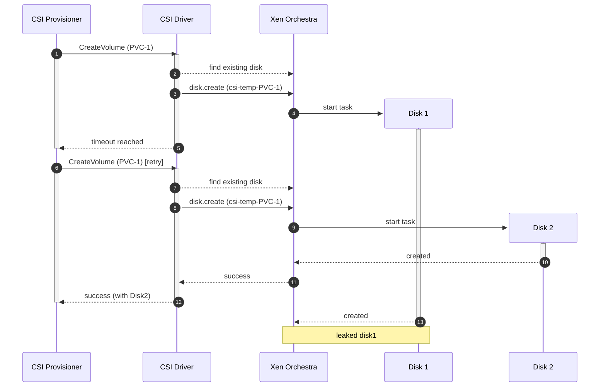

# Disk Creation Leakage

When the CSI external-provisioner asks the driver to create a volume, the driver issues a disk creation request to Xen Orchestra (XO). If XO does not respond within the [provisioner timeout](#mitigation-increase-csi-provisioner-timeout), the provisioner will retry the request. Because there is no trivial way to check whether a creation is already in progress in XO, a retry can result in multiple disks being created for the same PVC (leakage).

The chance of this happening can be reduced by keeping the the provisioner timeout high (see: [Mitigation: increase csi-provisioner timeout](#mitigation-increase-csi-provisioner-timeout)).

If this can happen in your environment, enable [Temp Cleanup](#temp-cleanup) to automatically remove leaked temporary disks.

## Why this happens

This race only materializes under a specific sequence:

- CreateVolume is invoked (creation A starts in XO)
- Creation takes a long time
- The provisioner timeout elapses
- The provisioner retries CreateVolume
- No finished disk is visible yet → a second creation (B) is issued
- Creation B completes (regardless of whether A is still running)

If B also times out but A completes first, the next retry will reuse A instead. Leakage occurs when two creations complete for the same volume name.

Timeline:




## What the driver does to mitigate

1) Have a high provisioning timeout by default (120s) (see to increase: [Mitigation: increase csi-provisioner timeout](#mitigation-increase-csi-provisioner-timeout))

2) Temporary names during creation

- Disks are created with a temporary name prefix first (default `csi-temp-<pvcName>`), then renamed to the final name (default `csi-<pvcName>`) once the operation completes.
- Renaming is fast, which reduces the window where duplicates can persist under the final name.

3) Optional: Automated cleanup ([Temp Cleanup](#temp-cleanup))

- A background cleanup process can be enabled to find and delete leaked temporary disks.
- It periodically scans for disks that still have the temporary prefix and marks them for deletion after a grace period.

---

## Temp Cleanup

A controller-side background process that removes leaked temporary disks created under the `csi-temp-` prefix.

- Enable with the controller flag: `--temp-cleanup=true`.
- Uses the temporary name prefix (derived from `--disk-name-prefix`, default `csi-` → `csi-temp-`).
- Targets only disks with the temporary prefix; do not use that prefix for user-managed disks.
- Recommended when disk creation may exceed the provisioner timeout or under intermittent XO/API latency.

Configuration tips:
- Set a unique `--disk-name-prefix` per cluster if multiple clusters share the same Xen Orchestra instance.
- Monitor controller logs to verify cleanup is running and deleting old temporary disks.


---

## Mitigation: increase csi-provisioner timeout

If your environment has slow disk creation in Xen Orchestra, increase the CSI sidecar timeouts to reduce retries (and thus leakage probability).

- Provisioning path: the `csi-provisioner` container flag `--timeout` controls the gRPC call timeout to the driver.
- Incase the timeout of the calls to xoa as well for `csi-xen-orchestra-driver` container with flag `--xoa-timeout`.


In the Helm chart, the defaults are set to `300s`. You can override them using Helm values. Example configuration:

```yaml
# values.yaml
controller:
  csiProvisioner:
    timeout: "600s"  # increase to 10 minutes
csiXenOrchestraDriver:
  config:
    xoaTimeout: "600s"  # increase to 10 minutes
```


Notes:
- Choose a value that comfortably exceeds your slowest observed XO disk creation time.
- Increasing the timeout reduces retry frequency but does not fully eliminate the possibility of leakage. Enable Temp Cleanup alongside this change.

