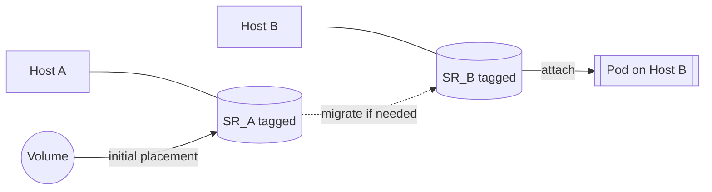

# Disk migrations

Disk migrations let the driver transparently move a volume between Storage Repositories (SRs) at attach time so a Pod can run on any suitable node. Enable migrations per StorageClass with the `migrating: "true"` parameter.

Important constraints:
- Use `srsWithTag` to select a set of eligible SRs. Migrating does not make sense with a single fixed `srUUID` and is rejected if both are set.
- Works with both local and shared SRs as long as they are selected via `srsWithTag`.

## Prerequisites

- Tag every SR that should participate with a common tag in Xen Orchestra (XO).
- Ensure each hypervisor/pool has at least one SR with that tag, and all SRs under the tag are either all local or all shared.
- Use a StorageClass that sets `srsWithTag` and `migrating: "true"`.
- Choose `volumeBindingMode` based on your setup:
  - Local SRs: prefer `WaitForFirstConsumer` to minimize migrations at first attach.
  - Shared SRs: `Immediate` is fine; migration will still occur if needed to meet topology/capacity.

Example StorageClass:

```yaml
apiVersion: storage.k8s.io/v1
kind: StorageClass
metadata:
  name: xoa-migrating
provisioner: csi.xen-orchestra.marcsi.ch
parameters:
  csi.storage.k8s.io/fstype: ext4
  srsWithTag: k8s-migrating
  migrating: "true"
volumeBindingMode: WaitForFirstConsumer
allowVolumeExpansion: true
```

## Storage Repository tags


## Disk identification with migrations

When `migrating` is enabled, the driver identifies volumes by disk name (not VDI UUID).

- Reason: migrating a disk between SRs creates a new VDI with a new UUID; the name remains stable and is used as the volume handle.
- Implications:
  - Do not rename driver-managed VDIs in XO; renaming breaks tracking.
  - Avoid creating VDIs with duplicate names; names should be unique within the cluster.
  - Disk names are prefixed with `csi-` (customizable via `--disk-name-prefix`).

## How it works

Example for `local` Storage Repositories:



- Initial placement: from all SRs with the configured tag, the driver picks a suitable SR based on topology preferences and free capacity.
- Attach-time migration: if the VM’s host/pool requires another SR and `migrating` is enabled, the disk is migrated to a valid SR and then attached.
- If the disk already resides on a valid SR for the target VM, it is attached directly.

## Compatibility notes

- `srUUID` and `migrating` cannot be set together; use `srsWithTag` with `migrating`.
- All SRs under the chosen tag must share the same "shared" characteristic (all local or all shared).


