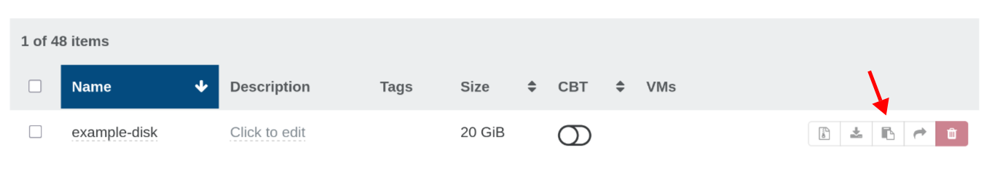

# Static

Static provisioning lets you use an existing VDI (disk) directly by referencing its UUID. This is useful when you have precreated disks or want to import existing data volumes.

### Finding the VDI UUID in Xen Orchestra




## Topology

- Important: the driver does not currently advertise CSI topology. The Kubernetes scheduler is therefore unaware of where a static volume can be attached.
- Impact:
  - For shared SRs: usually fine, as the SR is accessible to all hosts in the pool. The driver validates pool alignment at attach.
  - For local (non-shared) SRs: a Pod may be scheduled onto a node whose VM runs on a different hypervisor than the SR’s host. The attach will fail with a precondition error. You must constrain scheduling (e.g., nodeSelector/nodeAffinity) so the Pod lands on the node whose VM is on the SR’s host, or move the VM to that host.

## How to reference an existing VDI

Create a PersistentVolume (PV) that references the VDI UUID via `volumeHandle`, then a PVC that binds to that PV.

### Example PV

```yaml
apiVersion: v1
kind: PersistentVolume
metadata:
  name: xoa-static-pv
spec:
  accessModes:
    - ReadWriteOnce
  capacity:
    storage: 10Gi
  persistentVolumeReclaimPolicy: Retain
  csi:
    driver: csi.xen-orchestra.marcsi.ch
    volumeHandle: <vdi-uuid-here>
    fsType: ext4
```

### Example PVC

```yaml
apiVersion: v1
kind: PersistentVolumeClaim
metadata:
  name: xoa-static-pvc
spec:
  accessModes:
    - ReadWriteOnce
  resources:
    requests:
      storage: 10Gi
  volumeName: xoa-static-pv
```

Notes:
- The `volumeHandle` must be the exact VDI UUID from XO.
- Size in the PV is advisory; the actual disk size is taken from the VDI.
- Set `persistentVolumeReclaimPolicy: Retain` if you do not want the volume deleted when the PV is removed.

