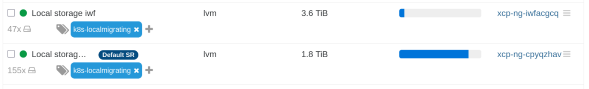
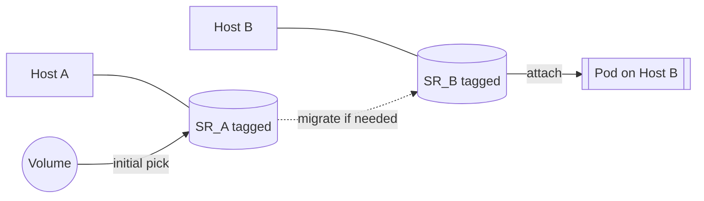

# Type: Local-Migrating

Local-migrating is special driver feature designed for environments where each hypervisor has its own local Storage Repository (SR). With this mode, you tag the SRs you want to use on each host, and the driver ensures a Pod's disk lives on the tagged SR of the host where the Pod runs.

## Prerequisites

- Tag every SR that should participate with a common tag in Xen Orchestra (XO).
- Ensure each hypervisor has at least one SR with that tag.
- Use a StorageClass with `type: localmigrating` and set `srsWithTag` to the tag you chose.
- Prefer `volumeBindingMode: Immediate` so the disk is created before scheduling. Migration still happens at attach time.

Example StorageClass:

```yaml
apiVersion: storage.k8s.io/v1
kind: StorageClass
metadata:
  name: xoa-localmigrating
provisioner: csi.xen-orchestra.marcsi.ch
parameters:
  csi.storage.k8s.io/fstype: ext4
  type: localmigrating
  srsWithTag: k8s-localmigrating
volumeBindingMode: Immediate
allowVolumeExpansion: true
```

## Storage Repository Tags




## Disk identification

In local-migrating, the driver tracks a volume by its disk name (not the VDI UUID).

- Why: migrating a disk between SRs creates a new VDI with a new UUID in Xen Orchestra, so the UUID is not stable across hosts. The name remains stable and is used as the volume handle.
- What this means for you:
  - Do not rename driver-managed VDIs in XO; renaming breaks tracking.
  - Avoid creating other VDIs with the same name; names are expected to be unique per cluster.
  - names are prefixed with `csi-` (can be customized with `--disk-name-prefix`)

## How it works



- Initial placement: when a volume is created, the driver lists all SRs with the configured tag and picks the SR with the most free capacity across the pool for the initial placement.
- Attach-time migration: when a Pod lands on a host whose tagged SR differs from the volume’s current SR, the driver migrates the volume to that host’s tagged SR and then attaches it.
- If the volume is already on the host’s tagged SR, it is attached directly without migration.


